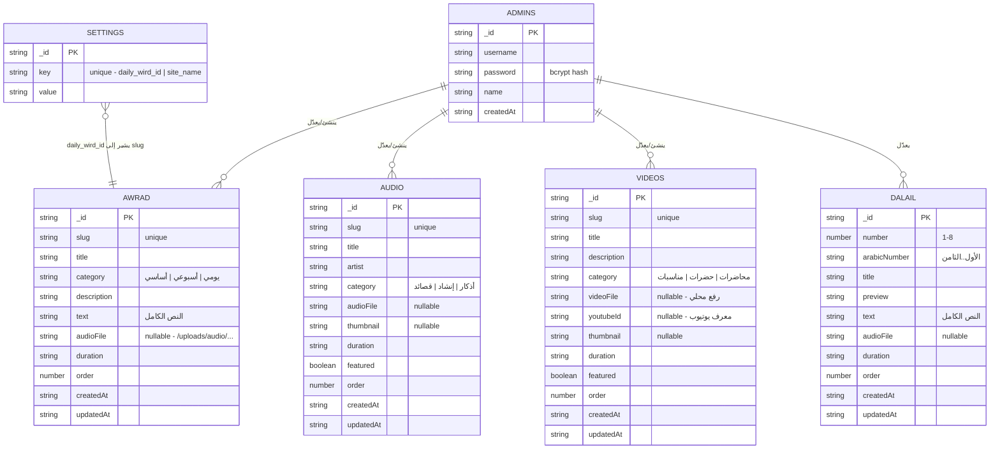

# مخطط قاعدة البيانات — ERD
## موقع الطريقة البيومية الأحمدية — السادة آل سلَّام

> **تقنية التخزين:** NeDB (قاعدة بيانات JSON مدمجة، بدون اعتمادات native).
> كل Collection مخزّن كملف `.db` مستقل في `backend/data/`.
> يمكن استبدالها لاحقاً بـ MongoDB أو PostgreSQL بأقل تعديل بفضل الـ `database.js` wrapper.

---

## مخطط العلاقات (Mermaid ERD)



---

## وصف الجداول (Collections)

### 1. `admins` — المديرون
| الحقل | النوع | الوصف |
|---|---|---|
| `_id` | string | معرف NeDB التلقائي |
| `username` | string | اسم المستخدم (افتراضي: `admin`) |
| `password` | string | hash بـ bcrypt (10 rounds) |
| `name` | string | الاسم المعروض |
| `createdAt` | ISO string | تاريخ الإنشاء |

**القيم الافتراضية المزروعة:** `admin` / `admin123` — **يجب تغييرها فوراً بعد أول دخول من صفحة الإعدادات.**

---

### 2. `awrad` — الأوراد
| الحقل | النوع | الوصف |
|---|---|---|
| `_id` | string | معرف NeDB |
| `slug` | string | معرف فريد يُستخدم في الروابط والـ API (`wird-sabahi`) |
| `title` | string | عنوان الورد |
| `category` | enum | `يومي` \| `أسبوعي` \| `أساسي` |
| `description` | string | وصف مختصر يظهر في البطاقة |
| `text` | string | النص الكامل (يدعم `\n` للفواصل) |
| `audioFile` | string\|null | مسار الملف الصوتي المرفوع |
| `duration` | string | مدة التسجيل (`15:30`) |
| `order` | number | ترتيب العرض |
| `createdAt` / `updatedAt` | ISO string | الطوابع الزمنية |

**العلاقة مع `settings`:** حقل `settings.daily_wird_id` يحتوي على `slug` من هذا الجدول، يحدد "ورد اليوم" المعروض في الصفحة الرئيسية.

---

### 3. `audio` — المكتبة الصوتية
| الحقل | النوع | الوصف |
|---|---|---|
| `_id` | string | معرف NeDB |
| `slug` | string | معرف فريد |
| `title` | string | عنوان المقطع |
| `artist` | string | اسم المنشد/المؤدي |
| `category` | enum | `أذكار` \| `إنشاد` \| `قصائد` |
| `audioFile` | string\|null | مسار الملف الصوتي |
| `thumbnail` | string\|null | صورة مصغرة |
| `duration` | string | المدة |
| `featured` | boolean | يظهر في "أحدث الإضافات" بأولوية |
| `order` | number | ترتيب العرض |
| `createdAt` / `updatedAt` | ISO string | الطوابع الزمنية |

---

### 4. `videos` — مكتبة الفيديو
| الحقل | النوع | الوصف |
|---|---|---|
| `_id` | string | معرف NeDB |
| `slug` | string | معرف فريد |
| `title` | string | عنوان الفيديو |
| `description` | string | وصف |
| `category` | enum | `محاضرات` \| `حضرات` \| `مناسبات` |
| `videoFile` | string\|null | رفع محلي (`/uploads/video/...`) |
| `youtubeId` | string\|null | معرف يوتيوب (بديل للرفع المحلي) |
| `thumbnail` | string\|null | صورة مصغرة |
| `duration` | string | المدة |
| `featured` | boolean | يظهر في البطاقة الكبيرة بالأعلى |
| `order` | number | ترتيب العرض |
| `createdAt` / `updatedAt` | ISO string | الطوابع الزمنية |

> **قاعدة:** يُفترض أن يحتوي كل سجل على **واحد فقط** من `videoFile` أو `youtubeId`. الواجهة تتحقق من `youtubeId` أولاً.

---

### 5. `dalail` — دلائل الخيرات (8 أحزاب ثابتة)
| الحقل | النوع | الوصف |
|---|---|---|
| `_id` | string | معرف NeDB |
| `number` | number | رقم الحزب (1-8) — **لا يُحذف أو يُضاف، فقط يُعدَّل** |
| `arabicNumber` | string | الترقيم العربي (الأول، الثاني...) |
| `title` | string | عنوان الحزب |
| `preview` | string | أول جملة تُعرض في الشبكة |
| `text` | string | النص الكامل |
| `audioFile` | string\|null | تسجيل صوتي للحزب |
| `duration` | string | المدة |
| `order` | number | الترتيب (يطابق `number`) |
| `createdAt` / `updatedAt` | ISO string | الطوابع الزمنية |

---

### 6. `settings` — إعدادات الموقع (key-value)
| الحقل | النوع | الوصف |
|---|---|---|
| `_id` | string | معرف NeDB |
| `key` | string | `daily_wird_id` \| `site_name` |
| `value` | string\|null | القيمة المقابلة |

**أمثلة:**
```json
{ "key": "daily_wird_id", "value": "wird-asasi" }
{ "key": "site_name", "value": "الطريقة البيومية الأحمدية — السادة آل سلَّام" }
```

---

## ملاحظات التصميم

1. **لا يوجد جدول للمستخدمين العامين** — الموقع بالكامل عام بدون تسجيل دخول للمريدين، طبقاً للمتطلبات الأصلية. فقط `admins` للوحة التحكم.

2. **العلاقات Soft Reference فقط** — `settings.daily_wird_id` يخزن `slug` كنص حر بدون foreign key حقيقي (NeDB لا يدعم FK)؛ التحقق من الصلاحية يحدث على مستوى التطبيق (`routes/settings.js`).

3. **الترقية لقاعدة بيانات علائقية:** الـ wrapper في `database.js` (`find`, `findOne`, `insert`, `update`, `remove`, `count`) صُمم بحيث يمكن استبدال NeDB بـ PostgreSQL/MongoDB عبر تغيير ملف واحد فقط دون التأثير على الـ routes.

4. **الفهرسة المقترحة عند الترقية لـ MongoDB:**
   - `awrad.slug` (unique)
   - `audio.slug` (unique)
   - `videos.slug` (unique)
   - `dalail.number` (unique)
   - `admins.username` (unique)
   - `settings.key` (unique)
